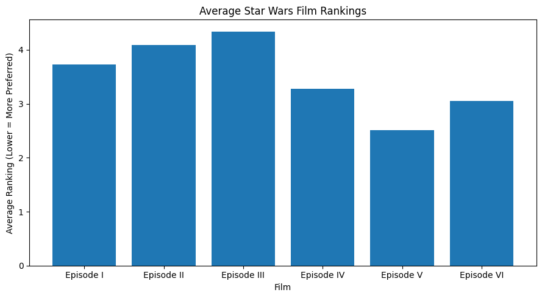
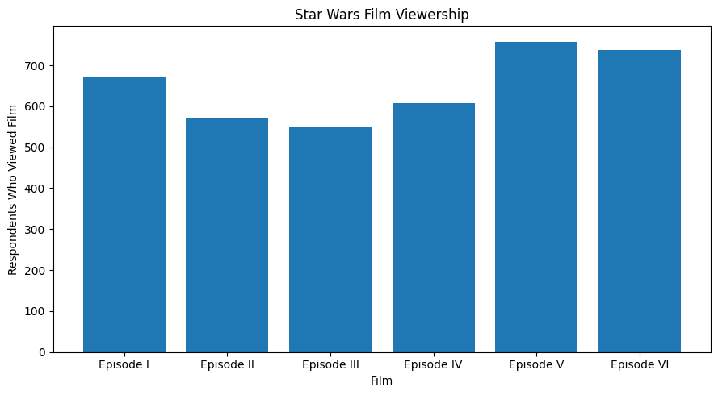
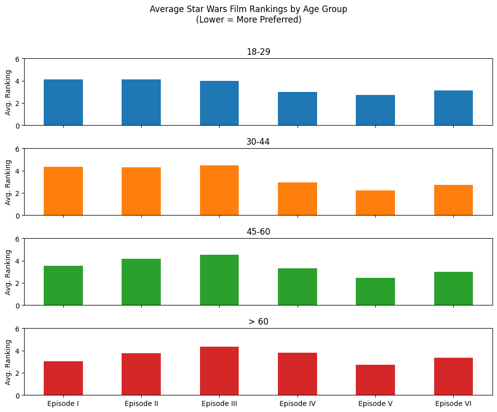
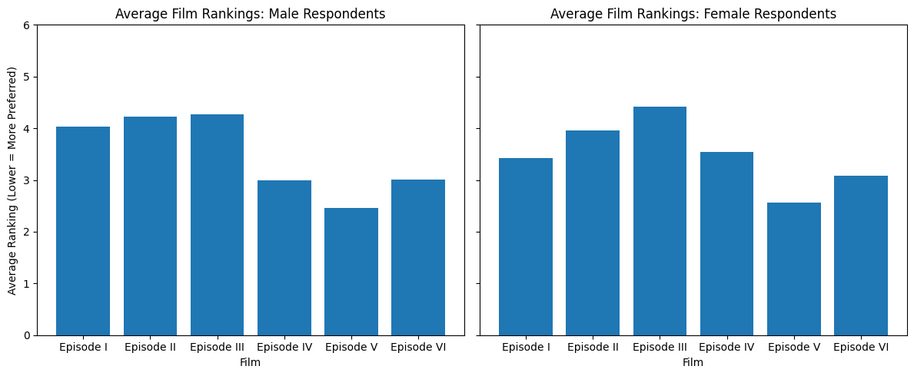
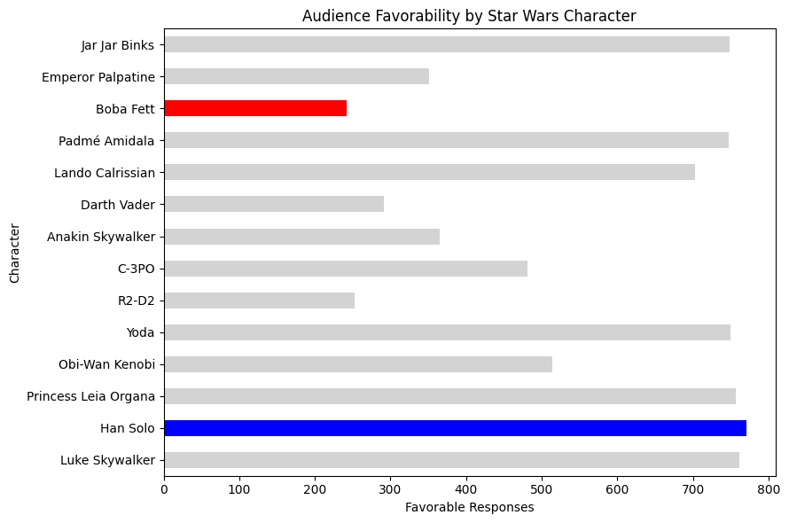

# Star Wars Audience & Preference Analysis

## The Question

What do Star Wars audience preferences reveal about film popularity, viewing behavior, and differences across demographic groups?

The analysis shows a clear preference for the **original trilogy (Episodes IV–VI)**, with *The Empire Strikes Back* receiving the strongest average ranking. This preference remains broadly consistent across gender, age group, and U.S. census region, while viewership and character sentiment reveal additional differences in audience engagement.

## What the Audience Data Shows

| Strongest-Ranked Film | Most Popular Trilogy | Key Audience Pattern |
|---|---|---|
| The Empire Strikes Back | Original Trilogy | Preference remains consistent across major demographic groups |

The original trilogy consistently receives stronger average rankings than the prequel trilogy, and Episodes IV–VI also have the highest overall viewership.

*The Empire Strikes Back* stands out as the strongest-ranked film overall, suggesting that audience preference extends beyond simple exposure or franchise familiarity.

## Audience Viewing Behavior

Viewership is concentrated around the original trilogy, with Episodes IV–VI reaching more respondents than the prequel films.

Comparing viewership with average rankings also shows that several of the most widely viewed films are among the highest-rated, suggesting a relationship between audience reach and preference.

## Audience Segmentation

### 1. Preference remains strong across age groups

The original trilogy ranks highly across all age groups, indicating that its appeal is not limited to respondents who may have experienced the films when they were originally released.

This suggests sustained franchise value across generations rather than preference being driven by only one demographic segment.

### 2. Male and female respondents show similar overall preferences

Both male and female respondents generally prefer the original trilogy.

However, male respondents reported higher viewership of the prequel trilogy, while female respondents who had seen those films tended to rank them somewhat more favorably.

### 3. Regional preferences are broadly consistent

Across U.S. census regions, the original trilogy generally maintains stronger average rankings than the prequel trilogy.

The consistency across regions suggests that preference for Episodes IV–VI is relatively broad rather than concentrated in a particular geographic market.

## Character Sentiment

Audience sentiment varies substantially across major Star Wars characters.

Han Solo receives the highest number of favorable responses in the survey analysis, while several characters generate substantially more neutral or mixed reactions.

Character-level analysis provides another way to understand audience attachment beyond movie-level rankings and viewership.

## Audience Insights

### 1. The original trilogy represents the franchise's strongest audience asset

Episodes IV–VI combine strong rankings with high viewership, indicating both broad reach and strong audience preference.

For an entertainment or marketing team, this type of result could help identify which properties or franchise elements have the strongest existing audience affinity.

### 2. Audience preference is relatively durable across demographics

The original trilogy performs strongly across gender, age group, and geographic region.

That consistency suggests broad audience appeal and could support marketing strategies designed around cross-demographic rather than highly segmented positioning.

### 3. Viewership and preference should be evaluated separately

High awareness or viewership does not necessarily mean an audience values every property equally.

Combining exposure metrics with preference measures provides a more complete understanding of audience engagement than relying on viewership alone.

### 4. Character sentiment can reveal differences in audience attachment

Character-level favorability analysis shows that audience engagement varies considerably within the same franchise.

For entertainment analytics, similar analysis could help evaluate talent, characters, intellectual property, or content elements that generate stronger audience affinity.

## How I Built It

- **Pandas:** Cleaned and transformed raw survey data, including Yes/No responses, checkbox-style multi-response fields, movie rankings, demographic variables, and character sentiment data.
- **Data Wrangling:** Converted categorical responses into boolean variables, renamed inconsistent survey columns, handled missing values, and standardized fields for analysis.
- **Exploratory Data Analysis:** Compared film rankings, viewership, demographic segments, geographic regions, and character sentiment.
- **Visualization:** Used Matplotlib to communicate audience preferences and differences across films and demographic groups.
- **Tools:** Python, Pandas, NumPy, Matplotlib, Jupyter Notebook
